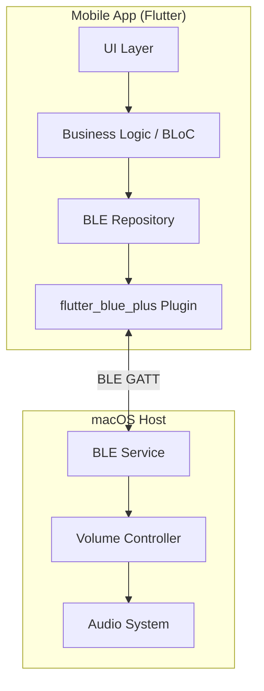
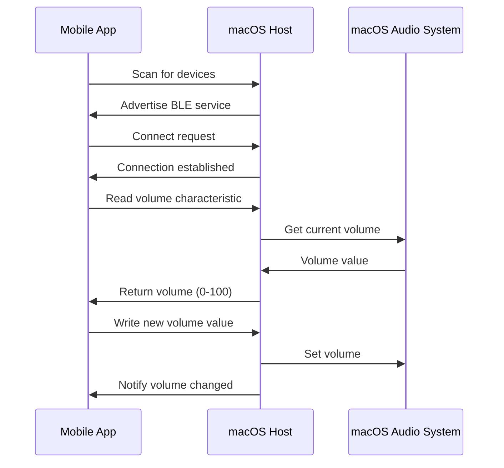

# Design Document

## Overview

このシステムは、FlutterベースのモバイルアプリケーションとmacOS上のネイティブBLEサーバーの2つの主要コンポーネントで構成されます。モバイルアプリはBLEクライアントとして動作し、macOSホストはBLEペリフェラルとして音量制御サービスを提供します。

通信プロトコルはBluetooth Low Energy (BLE) 4.0以上を使用し、カスタムGATTサービスとキャラクタリスティックを定義して音量データの読み取り、書き込み、通知を実現します。

## Architecture

### System Architecture



### Communication Flow



## Components and Interfaces

### Mobile App Components

#### 1. UI Layer
- **VolumeControlScreen**: メイン画面ウィジェット
  - 音量スライダー
  - ミュートボタン
  - 接続状態表示
  - デバイス選択UI

- **DeviceScanScreen**: デバイス検索画面
  - スキャン中インジケーター
  - 発見されたデバイスリスト
  - 接続ボタン

#### 2. Business Logic Layer (BLoC Pattern)
- **VolumeControlBloc**
  - States: `VolumeState` (disconnected, connecting, connected, error)
  - Events: `ConnectDevice`, `DisconnectDevice`, `SetVolume`, `ToggleMute`, `VolumeChanged`
  - 音量変更のデバウンス処理（100ms）

- **DeviceScanBloc**
  - States: `ScanState` (idle, scanning, found)
  - Events: `StartScan`, `StopScan`, `DeviceFound`

#### 3. Repository Layer
- **BleRepository**
  ```dart
  abstract class BleRepository {
    Stream<List<BluetoothDevice>> scanForDevices();
    Future<void> connect(BluetoothDevice device);
    Future<void> disconnect();
    Stream<int> get volumeStream;
    Future<void> setVolume(int volume);
    Future<void> toggleMute();
    Future<int> getCurrentVolume();
  }
  ```

- **BleRepositoryImpl**
  - flutter_blue_plusを使用した実装
  - 接続管理
  - 再接続ロジック
  - エラーハンドリング

#### 4. Models
```dart
class VolumeData {
  final int level;      // 0-100
  final bool isMuted;
  final DateTime timestamp;
}

class ConnectionState {
  final bool isConnected;
  final String? deviceName;
  final String? deviceId;
  final String? errorMessage;
}
```

### macOS Host Components

#### 1. BLE Service (Swift)
- **VolumeControlPeripheral**
  - CBPeripheralManagerを使用
  - カスタムサービスUUID: `"12345678-1234-1234-1234-123456789ABC"`
  - キャラクタリスティック:
    - Volume (UUID: `"12345678-1234-1234-1234-123456789ABD"`)
      - Properties: Read, Write, Notify
      - Value: UInt8 (0-100)
    - Mute (UUID: `"12345678-1234-1234-1234-123456789ABE"`)
      - Properties: Read, Write, Notify
      - Value: UInt8 (0=unmuted, 1=muted)

#### 2. Volume Controller (Swift)
- **MacVolumeController**
  ```swift
  class MacVolumeController {
    func getVolume() -> Float
    func setVolume(_ volume: Float)
    func getMuteState() -> Bool
    func setMuteState(_ muted: Bool)
    func observeVolumeChanges(callback: @escaping (Float) -> Void)
  }
  ```
  - CoreAudioを使用してシステム音量を制御
  - AudioObjectPropertyListenerを使用して音量変更を監視

#### 3. macOS App Structure
- メニューバーアプリとして実装
- バックグラウンドで常時実行
- 接続状態をメニューバーアイコンで表示

## Data Models

### BLE GATT Profile

**Service: Volume Control Service**
- UUID: `12345678-1234-1234-1234-123456789ABC`

**Characteristics:**

1. **Volume Level**
   - UUID: `12345678-1234-1234-1234-123456789ABD`
   - Type: UInt8
   - Range: 0-100
   - Properties: Read, Write, Notify
   - Description: 現在の音量レベル（パーセンテージ）

2. **Mute State**
   - UUID: `12345678-1234-1234-1234-123456789ABE`
   - Type: UInt8
   - Values: 0 (unmuted), 1 (muted)
   - Properties: Read, Write, Notify
   - Description: ミュート状態

### State Management

```dart
// Volume State
sealed class VolumeState {}
class VolumeDisconnected extends VolumeState {}
class VolumeConnecting extends VolumeState {
  final String deviceName;
}
class VolumeConnected extends VolumeState {
  final VolumeData volumeData;
  final String deviceName;
}
class VolumeError extends VolumeState {
  final String message;
}

// Volume Event
sealed class VolumeEvent {}
class ConnectToDevice extends VolumeEvent {
  final BluetoothDevice device;
}
class DisconnectFromDevice extends VolumeEvent {}
class SetVolumeLevel extends VolumeEvent {
  final int level;
}
class ToggleMuteState extends VolumeEvent {}
class VolumeUpdatedFromDevice extends VolumeEvent {
  final VolumeData data;
}
```

## Error Handling

### Mobile App Error Scenarios

1. **Bluetooth無効**
   - エラーメッセージ表示
   - 設定画面へのディープリンク提供

2. **接続失敗**
   - 3回まで自動リトライ（5秒間隔）
   - リトライ失敗後はデバイス選択画面に戻る
   - エラー理由を表示

3. **通信タイムアウト**
   - 書き込み操作: 3秒タイムアウト
   - 読み取り操作: 2秒タイムアウト
   - タイムアウト時は接続状態を確認

4. **無効な音量値**
   - クライアント側で0-100の範囲チェック
   - 範囲外の値は最も近い有効値にクランプ

### macOS Host Error Scenarios

1. **Bluetooth権限なし**
   - アプリ起動時に権限チェック
   - 権限リクエストダイアログ表示
   - 権限なしの場合はエラー通知

2. **無効なコマンド受信**
   - 値の範囲チェック
   - 無効な値は無視してログ記録
   - エラー応答は送信しない（BLE仕様に従う）

3. **Audio System エラー**
   - CoreAudio APIエラーをキャッチ
   - ログに記録
   - 前回の正常値を保持

## Testing Strategy

### Unit Tests

**Mobile App:**
- BleRepository のモック実装を使用したテスト
- VolumeControlBloc の状態遷移テスト
- 音量値のバリデーションテスト
- デバウンス処理のテスト

**macOS Host:**
- VolumeController の音量設定/取得テスト
- BLE characteristic の読み書きテスト
- 値の範囲チェックテスト

### Integration Tests

- モバイルアプリとmacOSホスト間の実際のBLE通信テスト
- 接続/切断シーケンステスト
- 音量変更の往復テスト
- 再接続ロジックのテスト

### Manual Testing Scenarios

1. デバイス検索と接続
2. 音量スライダー操作
3. ミュートボタン操作
4. 接続中にBluetoothをオフにする
5. macOS側で音量を変更してアプリに反映されるか確認
6. 複数デバイスからの接続試行

## Dependencies

### Mobile App (Flutter)
- `flutter_blue_plus: ^1.32.0` - BLE通信
- `flutter_bloc: ^8.1.0` - 状態管理
- `equatable: ^2.0.0` - 値の比較
- `permission_handler: ^11.0.0` - 権限管理

### macOS Host
- CoreBluetooth framework - BLE実装
- CoreAudio framework - 音量制御
- SwiftUI - UI実装（メニューバーアプリ）

## Security Considerations

1. **ペアリング**: BLE接続時にペアリングを要求（Just Works方式）
2. **接続制限**: 同時に1つのデバイスのみ接続可能
3. **権限**: 両プラットフォームでBluetooth権限を適切に要求
4. **データ検証**: 受信した音量値の範囲チェック

## Performance Considerations

1. **音量変更のデバウンス**: スライダー操作時に100msのデバウンスを適用してBLE通信を削減
2. **通知の最適化**: 音量変更通知は値が実際に変更された場合のみ送信
3. **接続維持**: BLE接続を維持するためのキープアライブは不要（BLE仕様により自動管理）
4. **バッテリー消費**: BLE Low Energyを使用することで消費電力を最小化
